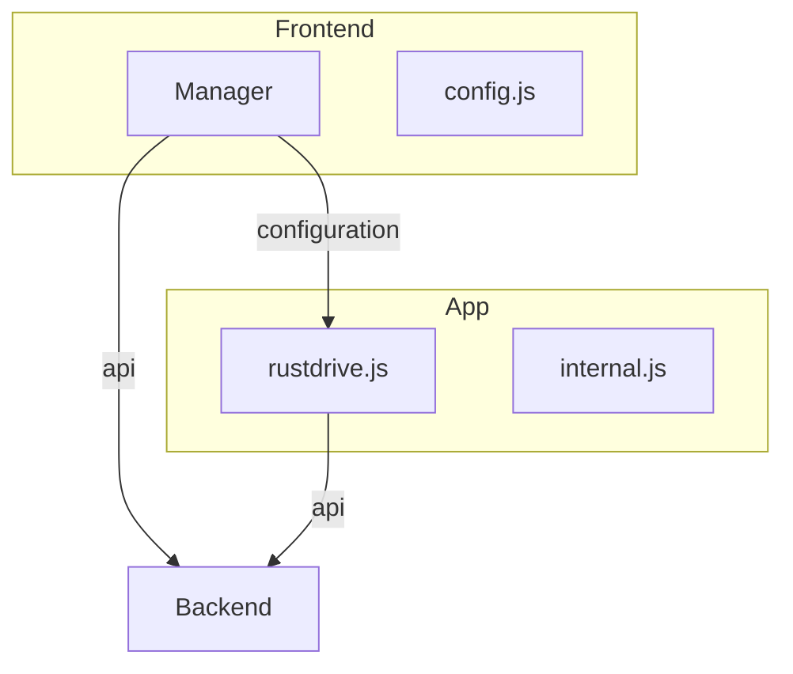

# Rustdrive Frontend

## Structure

This structure is built, so that it is possible to have the App hosted at a different server than the manager. So multible managers could access the same apps. This way it gets very easy to try new apps before hosting them yourself.

The App is embedded into the Manager via a Iframe. The manager talks to the App via post messages. The manager Informs the App with the Backend location and login data.

## Files App

Heavily inspired by Finder. It should be minimal and intuitive for everyone using it.

### MVP Roadmap

- [x] Implementing Naviagation
- [x] Implementing selections
- [x] Adding RMB Menus
- [ ] Implement Management
  - [ ] Rename
  - [ ] Cut
  - [ ] Copy
  - [ ] Paste
  - [ ] Delete
- [ ] Implement simple Data access
  - [x] Download
  - [ ] Upload
  - [ ] Replace
  - [ ] Metadata
