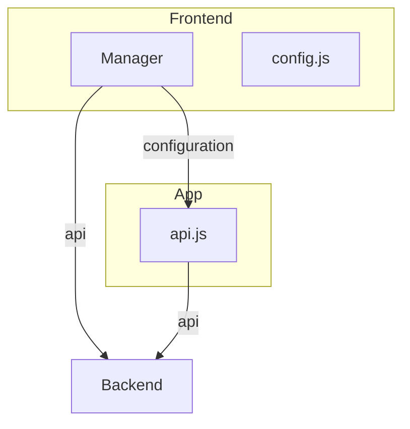

# Rustdrive Frontend

Design Concept

Current complications are how to refactor the api.js to make this implementations possible. It would be nice, if the api.js can get the configurations in different ways. Current plan would be to create different classes, one for configuration, one as api connector, one for the infos stored in the token ect.